# Visual Studio Code & Python

Visual Studio Code (také VSCode) je editor zdrojového kódu vyvíjený společností Microsoft pro operační systémy Windows, Linux a macOS. (viz oficiální web: [https://code.visualstudio.com/](https://code.visualstudio.com/) )

## Nastavení VSCode

VSCode umožňuje nastavit spoustu věcí a jelikož pracuji na Windows, budu se bavit hlavně o Windows, ale postupy by měly být totožné i v jiných operačních systémech.

Jedním ze základním příkazů ve VSCode je otevření příkazové řádky (pozor, jedná se o příkazovou řádku ve VSCode, neplést s příkazovou řádkou ve Winsows). Tato příkazová řádka umožňuje vykonávat různé operace, které jdou vyvolat i jinými způsoby (např. z menu), ale je snazší ji používat, protože umožňuje i textové vyhledávání. Vyvoláme ji jednám z následujících způsobů:

- z horního menu: `View > Command Pallete...`
- klávesová zkr.: `F1`
- klávesová zkr.: `CTRL+SHIFT+P` (na Macu `CMD+SHIFT+P`)

a po otevření vypadá následovně

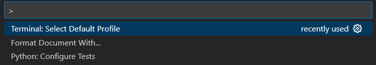

### Nastavení terminálu

VSCode umožňuje nastavit terminál v jakém budeme pracovat, nastavíme jej následovně:

1. Otevřeme VSCode příkazový řádek
1. Napíšeme `>Terminal: Select Default Profile`
(nebo jen část. Pozor, znak `>` na začátku je důležitý - nemazat)

    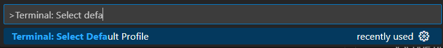

1. A vybereme preferovaný terminál - na Windows doporučuju `Command Prompt`, pro jednoduchost a kompatibilitu s kurzy.

    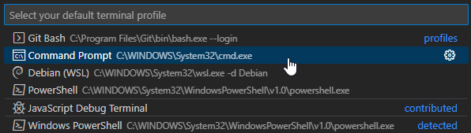

### Instalace rozšíření

VSCode umožňuje instalovat spoustuužitečných rozšíření a vytvořit tak z jednoduchého textového editoru velmi mocný nástroj.

Pro naši potřebu budeme potřebovat rozšíření `Python` (od Microsoftu), které nainstalujeme tak, že z levého panelu vybereme ikonu s čtverečky, vyhledávacího pole zadáme `Python` a klikneme na tlačítko `Install`.

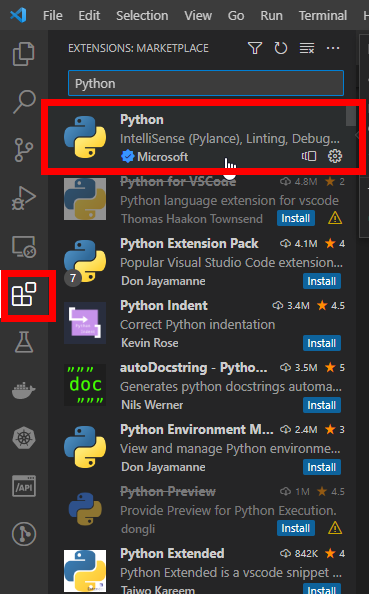

**Doporučení:** Pokud používáte svůj počítač, máte nainstalováno více rozšíření a víte, že jste je neinstalovali, je dobré je buď zakázat nebo rovnou odstranit - můžou způsobovat nepříjemnosti a zpomalovat celý VSCode.

## Práce s Pythonem ve VSCode

### Vytvoření virtuálního prostředí

1. Otevřete ve VSCode prázdnou složku (nebo složku bez virtuálního prostředí) - složka ve VSCode představuje něco jako projekt, obsahuje zdrojové soubory, ale ukládají se zde i různá nastavení, ...
1. Otevřete `Příkazovou řádku` ve VSCode (kláv. zkr: `F1`) a vyberte příkaz `>Python: Create Environment` (stačí napsat kousek, viz obrázek) a spustí se drobný průvodce, který vám usnadní vytvořit prostředí (viz jednotlivé kroky níže)

      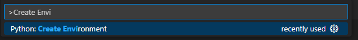

    - Výběr virtuálního prostředí (v kurzech používáme `Venv`)

      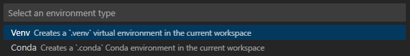

    - výběr verze Pythonu (stačí vybrat doporučenou verzi)

      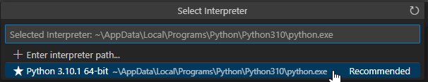

    V mé prázdné složce (`vscode_test`) se vytvoří virtuální prostředí (ve složce `.venv`)

      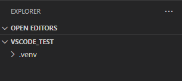

1. Koukneme, jestli se prostředí i aktivovalo...

    - otevřeme si terminál

        - pomocí klávesové zkratky `CTRL+;` (na Macu `CMD+;`) - pomocí této zkratky jde i skrývat a znovu zobrazovat
        - z menu `View > Terminal`

        Otevře se nový terminál s aktivovaným prostředím

        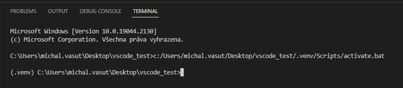

        Pokud chceme terminál odstranit, použijme ikonu koše (okno Terminálu v pravo nahoře) - ikona křížku terminál pouze schová.

        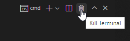

    - ověřit aktivní prostředí jde i ve spodním panelu, kde se ukáže, jakou verzi pythonu používáme, a že je opravdu z naší složky `.venv`

      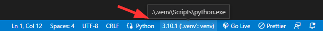

### Pytest

Python rozšíření taky celkem dobře integruje testování do VSCode. Zprovozníme jej následovně:

1. Otevřeme `VSCode příkazovou řádku` (`F1`) a zadáme příkaz `>Python: Configure Tests` (stčí napsat část, viz obr)

    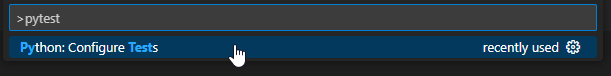

1. Vybereme testovací framework, který chceme použít (v našem případě `pytest`)

    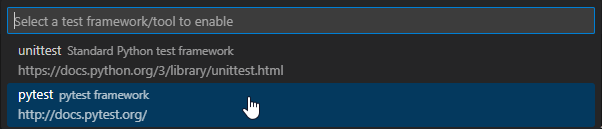

1. Vybert složku, kde jsou (či budou) umístěny testy (v našem případě `.` - hlavní složka projektu). Pytest bude testy hledat pouze v této složce a jejich potomcích.

    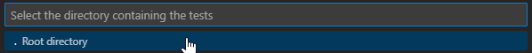

To je vše - Pytest je nainstalován, nastaven a připraven k použití. VSCode si taky uložilo nějaké nastavení (které jsme mu před chvílí zadali) v naší složce (projektu), které se znova načte při otevření této složky.

  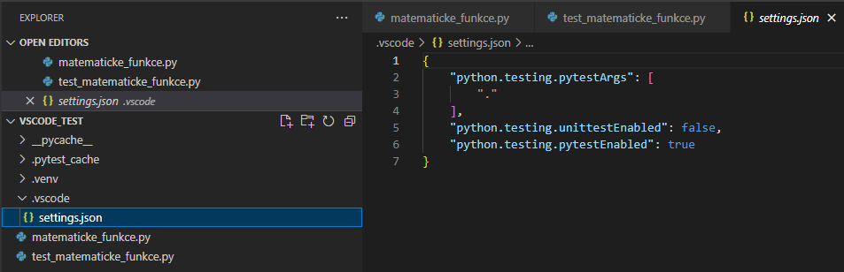

Jak Testy spustit? Jednouše, mámě několik možností

- přímo z editoru

  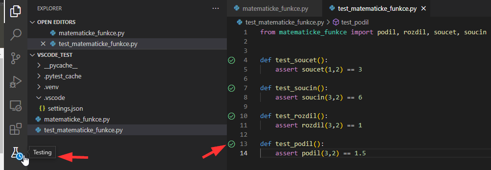

- ze speciálního panelu pro testy

  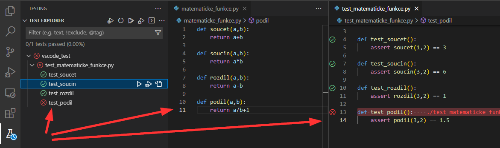

Ukázka chyby

  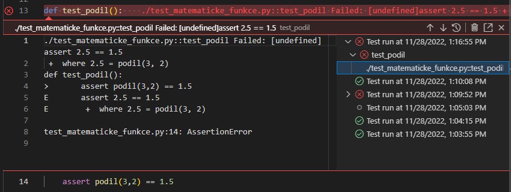

Poznámka: Samozřejmě můžeme testy pustit i z Terminálu ;-).
